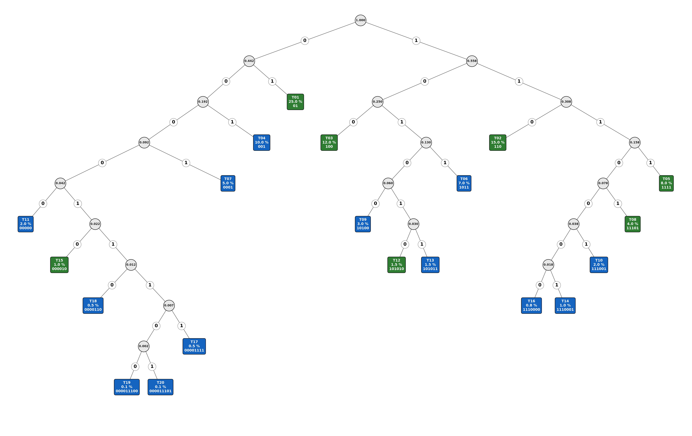
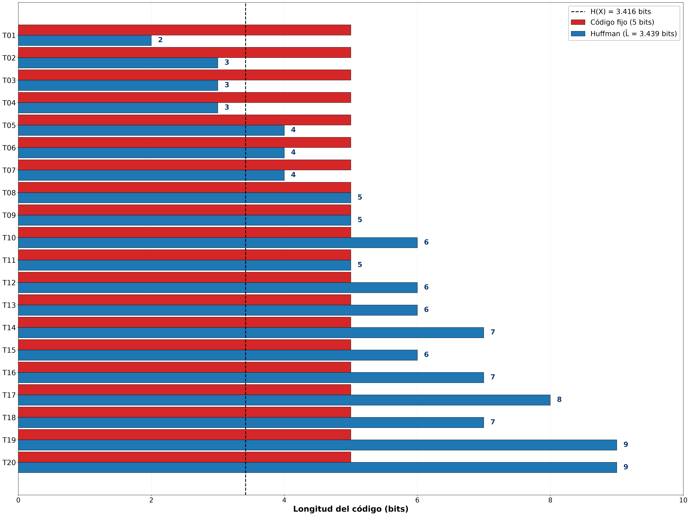
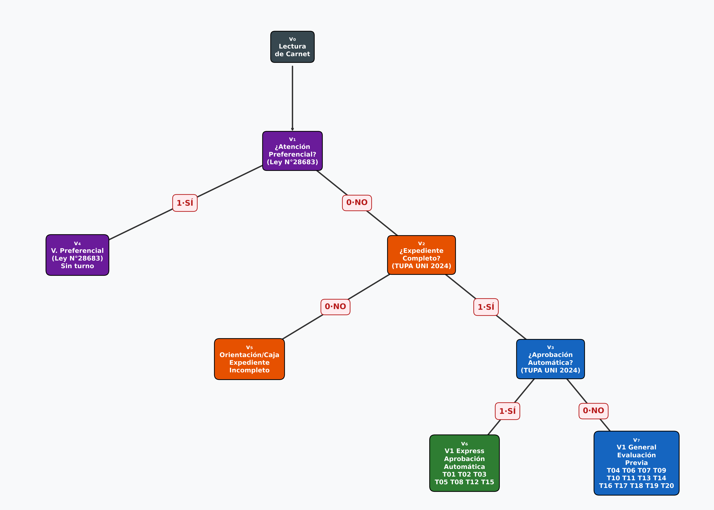
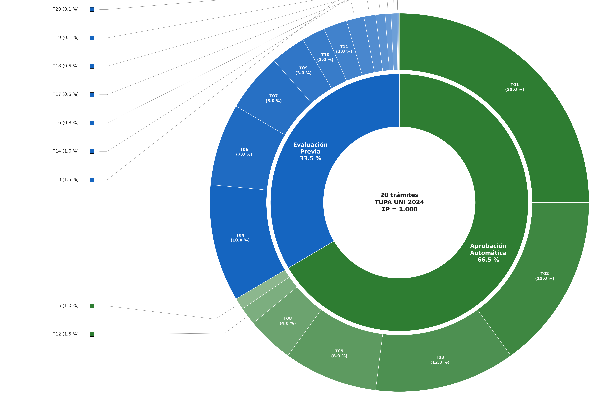

# FIIS Optimal Queue

Modelo de la cola de Mesa de Partes de la FIIS-UNI con codificación de Huffman y un árbol de decisión binario, que genera automáticamente las tablas y figuras de un artículo de investigación.

## Problema

La Mesa de Partes de la FIIS-UNI atiende 20 trámites distintos con una demanda muy desigual: uno solo concentra el 25 % del volumen y los cuatro más raros no llegan al 1 % entre todos. Tratarlos a todos igual —una sola cola, un identificador de longitud fija— desperdicia capacidad, y además ignora que el TUPA UNI 2024 y la Ley N° 28683 ya imponen rutas de atención distintas según el trámite y la condición del solicitante.

Este proyecto ataca las dos mitades del problema con dos estructuras de matemática discreta: **Huffman** para codificar los trámites en el mínimo número de bits posible, y un **árbol de decisión** con predicados normativos para enrutar a cada solicitante a la ventanilla que le corresponde por ley.

## Tech Stack

`Python 3.12` `NetworkX` `Matplotlib` `pytest` `uv` `heapq`

## Features

- Motor de Huffman sobre 20 trámites con probabilidades calibradas al TUPA UNI 2024, construido con min-heap en O(n log n).
- Desempate estable (FIFO) de pesos iguales: el árbol y los códigos son **reproducibles** entre corridas y entre máquinas.
- Métricas completas del código: longitud media L̄, entropía H(X), eficiencia η, igualdad de Kraft y verificación de la cota de Shannon.
- Codificación y decodificación de mensajes reales, aceptando la forma corta (`T01`) o completa (`T01_Constancia_Matricula`).
- Árbol de decisión de 8 nodos con **respaldo normativo explícito** por predicado (Ley N° 28683, TUPA UNI 2024), validado como DAG con trayectoria única raíz → hoja.
- Pipeline de un comando que regenera los 9 artefactos del artículo y **verifica invariantes matemáticas**, saliendo con código distinto de cero si alguna se rompe.
- 49 tests que comprueban propiedades del código óptimo en vez de valores fijos, de modo que recalibrar una probabilidad no obliga a reescribirlos.

## Screenshots

**Árbol de Huffman** — 20 hojas coloreadas por ventanilla, con probabilidad y código binario en cada una. Los trámites frecuentes quedan arriba (código corto) y los raros abajo.



**Código fijo vs Huffman** — longitud por trámite frente al baseline de 5 bits, con la entropía marcada como límite teórico.



**Árbol de decisión** — las 3 preguntas normativas y las 4 ventanillas, con la etiqueta binaria de cada arista.



**Distribución TUPA** — anillo exterior con los 20 trámites, interior consolidado por calificación procedimental.



## Installation

Requiere **[uv](https://docs.astral.sh/uv/)**, que gestiona el entorno y descarga la versión de Python fijada en `.python-version`. No hace falta instalar Python ni activar el venv a mano.

```bash
# Instalar uv (una sola vez por máquina)
curl -LsSf https://astral.sh/uv/install.sh | sh
# Windows (PowerShell):
#   powershell -c "irm https://astral.sh/uv/install.ps1 | iex"

git clone https://github.com/Hector-0-0/FIIS-Optimal-Queue.git
cd FIIS-Optimal-Queue

uv sync          # reconstruye el entorno exacto desde uv.lock
```

Al cambiar de dispositivo basta con `git pull && uv sync`.

## Usage

### Pipeline completo

Regenera los 9 artefactos en `outputs/` y verifica las invariantes:

```bash
uv run python run_pipeline.py
```

Sale con `0` si todo está correcto y con `1` si falta un artefacto o si alguna invariante matemática no se cumple.

### Módulos por separado

```bash
uv run python -m src.huffman           # Huffman: 3 CSV + 1 JSON
uv run python -m src.arbol_decision    # árbol de decisión: JSON + PNG
uv run python -m src.generar_graficas  # las 4 figuras (requiere Huffman antes)
```

Las figuras leen los JSON del disco, así que Huffman tiene que haber corrido y exportado antes.

### Consultar un trámite

```bash
uv run python consulta.py T01
```

```
Tramite     : T01 - Constancia de Matrícula
Ventanilla  : Ventanilla 1 Express — Aprobación Automática (TUPA UNI 2024)
Codigo ruta : 011  (v0 -> v1 -> v2 -> v3 -> v6)
Codigo Huffman: 01
```

Sin argumentos entra en modo interactivo y pregunta también por atención preferencial y completitud del expediente.

### Codificar y decodificar un mensaje

```bash
uv run python -c "
from src.huffman import HuffmanFIIS
h = HuffmanFIIS(); h.construir()
mensaje    = ['T01', 'T02', 'T01', 'T04']
codificado = h.codificar(mensaje)
print(f'{len(codificado)} bits con Huffman vs {len(mensaje) * 5} con codigo fijo')
print(h.decodificar(codificado))
"
```

### Cambiar las probabilidades

Edita `src/config.py`; la suma debe seguir siendo 1.0 o el pipeline aborta con `ValueError` indicando la diferencia exacta. Los tests no necesitan cambios: verifican propiedades, no números concretos.

### Tests

```bash
uv run pytest        # 49 tests, sin I/O
uv run pyflakes src/ run_pipeline.py consulta.py tests/
```

Los tests verifican invariantes (igualdad de Kraft, cota de Shannon, prefijo libre, ordenación por optimalidad) en vez de valores concretos de L̄ y H(X), y comprueban además que `outputs/tabla2_codigos.csv` siga coincidiendo con lo que produce el algoritmo, de forma que un artefacto desactualizado rompe la suite.

## Resultados

| Métrica | Valor | Interpretación |
|---|---|---|
| L̄ (Huffman) | 3.439 bits/símbolo | Longitud media del código óptimo |
| H(X) | 3.416 bits/símbolo | Entropía de Shannon (mínimo teórico) |
| η = H/L̄ | 99.33 % | Eficiencia del código |
| K(T) | 1.000000 | Igualdad de Kraft → prefijo libre y completo |
| Ahorro vs fijo (5 bits) | 31.22 % | Compresión frente al código de bloque |
| Cota de Shannon | 3.416 ≤ 3.439 < 4.416 | Verificada |
| Aprobación automática | 66.5 % del volumen | Trámites de 2–5 días hábiles |
| Evaluación previa | 33.5 % del volumen | Trámites de 10–30 días hábiles |

## Fundamento matemático

| Concepto | Fórmula | Aplicación |
|---|---|---|
| Entropía de Shannon | `H(X) = − Σ pᵢ · log₂(pᵢ)` | Cota inferior teórica de compresión |
| Longitud media | `L̄ = Σ pᵢ · lᵢ` | Costo promedio del código |
| Igualdad de Kraft | `Σ 2^(−lᵢ) = 1` | Código prefijo libre y completo |
| Teorema de Shannon | `H(X) ≤ L̄ < H(X) + 1` | Garantía de cuasi-optimalidad |
| Algoritmo de Huffman | Voraz + min-heap | Código óptimo en O(n log n) |

Fuentes normativas de los predicados del árbol de decisión:

- **v₁** — Ley N° 28683 (modifica la Ley N° 27408): atención preferencial.
- **v₂** — TUPA UNI 2024 (RR N° 3698-2024-UNI): admisibilidad del expediente.
- **v₃** — TUPA UNI 2024 (RR N° 3698-2024-UNI): calificación procedimental.

## Estructura

```
src/
├── config.py           # fuente única: distribución, ventanillas, normativa
├── huffman.py          # motor de Huffman (construcción, métricas, codec)
├── arbol_decision.py   # árbol de decisión (8 nodos, predicados legales)
└── generar_graficas.py # las 4 figuras del artículo
tests/                  # 49 tests (invariantes matemáticas y estructurales)
outputs/                # CSV, JSON y PNG generados por el pipeline
run_pipeline.py         # orquestador completo
consulta.py             # consulta rápida de un trámite
```

## Author

Héctor David Flores Sánchez — [LinkedIn](https://www.linkedin.com/in/héctor-david-flores-sánchez-76b636354/) · [Portfolio](https://hector-0-0.github.io/) · [Email](mailto:hector.d.flores.s@gmail.com)

Proyecto del curso de Matemática Discreta · FIIS-UNI · 2026-1
